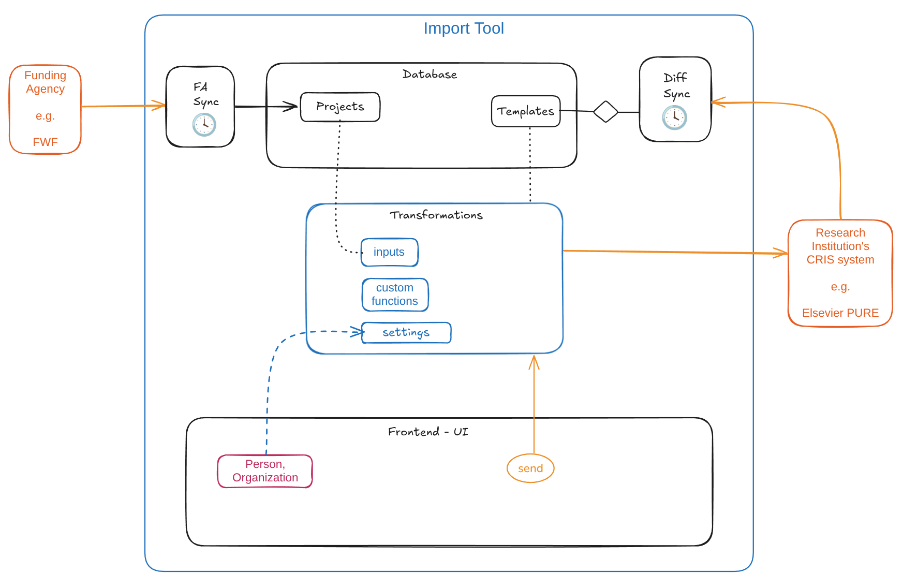

# Architecture

## ERD (Entity Relationship Diagram)

## Backend

### Core Components

The backend is structured around several interconnected models and utilities, each with a specific responsibility:

*   **`DiffSync`**: This component is responsible for orchestrating the **synchronization process between the Current Research Information System (CRIS) and the local database**. It processes projects fetched from the `ResearchInstitution` model, calculates differences, and stores them. The sync process can be initiated on a recurring timeout.
*   **`FundingAgency`**: Manages the retrieval of project data from external Funding Agencies (FA) and their subsequent **copying into the local database**. It can run this sync operation periodically based on a configured timeout. It fetches projects page by page and uses the `Differ` class to identify changes when updating existing projects.
*   **`ResearchInstitution` (RI)**: Acts as the primary interface for interacting with **external Research Information systems**, such as Pure. It provides methods to fetch project, application, award, and person data, search across categories, and add notes to entities. All interactions with external RI systems are routed through `callRIApi`.
*   **`Project`**: Represents research projects within the **local database**. It provides functionalities to check for project existence, retrieve projects by RIS ID, and link local projects to their CRIS counterparts. It also includes utility methods for finding ROR (Research Organization Registry) information, checking for specific RORs, and matching email domains within project data.
*   **`Template`**: Stores **YAML templates** used for data transformation pipelines. The system can retrieve templates by ID and fetch the latest template of a specific type (e.g., `PROJECT`).
*   **`Transform`**: Utilizes loaded `Function`s to **apply a given YAML template to input data**. This is a crucial step in preparing local RIS data for comparison with external CRIS data within the `Diff` process.
*   **`Function`**: Manages **custom JavaScript functions** stored in the database. These functions can be created, updated, read, and verified, and are executed within an isolated environment by the `Executer`.
*   **`Executer`**: Responsible for **safely executing YAML templates and custom functions**. It runs code within an isolated VM (`isolated-vm`) to prevent side effects and handles placeholders in YAML content, replacing them with values from input or settings. It also processes specific function calls prefixed with `!`.
*   **`Diff`**: Calculates and records **differences between CRIS data and transformed RIS data**. It retrieves project data from the local database, fetches CRIS data via `ResearchInstitution`, applies a `Template` through `Transform`, and then uses the `Differ` class to find deep differences. It can also apply `Omits` to exclude certain paths from diff calculations and saves the identified differences to the database.
*   **`Registry`**: Fetches and manages **API endpoints** (e.g., for funding and projects) from a central registry (`https://forschungsdaten.at/registry/registry.json`). It stores these endpoints and provides methods to retrieve specific URLs, which are then used by `FundingAgency` and `Project` for external API interactions.
*   **`Excel`**: Provides utilities for **processing and converting JSON data into Excel workbooks**. It can flatten nested JSON objects, normalize data structure for consistent columns, and reorder columns based on prioritization. It generates two sheets: "Essential List" (with a subset of keys) and "Complete List".

### Key Processes and Data Flows

#### Funding Agency (FA) to Database (DB) Synchronization

This process aims to populate and update the local database with project data from Funding Agencies.

*   The `FundingAgency` model's `start()` method initiates a **scheduled synchronization process** based on a `FA_SYNC_TIME` timeout.
*   `copyProjectToDatabase()` is called, which first **fetches all project pages** from the configured funding agency API. This involves authenticated requests via `getAuthEndpoint` and uses URLs resolved by `Registry`.
*   The fetched projects are then **saved to the database**. The system checks if a project already exists using its `risId`.
*   **New projects** are created.
*   For **existing projects**, the `upsertProject` method is called. It uses `Differ` to compare the new FA data with the existing `risData` in the database. If differences are found, the existing project's `risData` is updated in the database.

#### Data Transformation Pipeline

The system incorporates a robust data transformation pipeline, primarily used within the `Diff` synchronization process:

*   **Templates (`Template`)**: Define the desired structure and content for transformed data using **YAML templates**.
*   **Functions (`Function`)**: Allow for **custom logic** to be injected into the transformation process. These are JavaScript functions stored in the database and retrieved by `Transform`.
*   **Execution (`Executer`)**: The `Executer` takes a YAML template, input data, and settings. It replaces placeholders in the YAML and uses an **isolated JavaScript VM** (`isolated-vm`) to safely execute custom functions defined in the `Function` model. This ensures that custom code runs securely without affecting the main application.
*   **Transformation (`Transform`)**: Orchestrates the application of templates and functions, providing a reusable way to convert raw input data (e.g., `risData`) into a structured output that can be compared.
